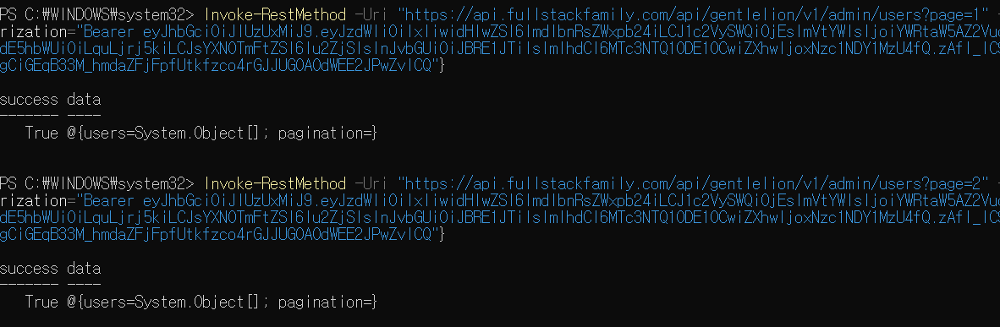
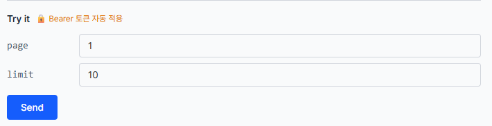
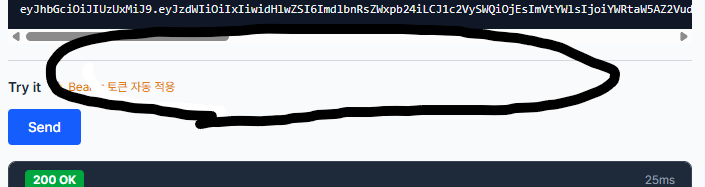

# API 수정 요청

## 목록

- 주문 목록 조회 userId 리소스 값 추가
- 모든 목록 조회 url?page=1 기능 추가
- 모든 목록 조회 API: Try it에서 page, limit 입력 추가

## 주문 목록 조회 userId 리소스 값 추가
```json
{
  "success": true,
  "data": {
    "orders": [
      {
        "orderId": 35,
        "userId": 1, // 추가
        "orderNumber": "GM20260406035",
        "status": "pending",
        "totalPrice": 290000,
        "shippingFee": 0,
        "finalPrice": 290000,
        "pointsUsed": 290000,
        "paymentMethod": "points",
        "items": [
          {
            "productId": 1,
            "productName": "GENTLE MONSTER 01",
            "name": "GENTLE MONSTER 01",
            "price": 290000,
            "orderPrice": 290000,
            "quantity": 1,
            "color": "Black"
          }
        ], ...
```
위의 코드와 같이 orderId값 아래에 주문한 userId값 추가를 요청합니다.


## 모든 목록 조회 url?page=1 기능 추가

대상: Orders(주문) 목록 조회, 관리자 회원 목록 조회, 관리자 주문 목록 조회

url?page=1 또는 url?page=2 일때 page 값에 해당되는 리소스를 보여주는 기능 추가를 요청합니다.



## 모든 목록 조회 API: Try it에서 page, limit 입력 추가

- 요청 추가


- 현재


Try it 부분에 page와 limit 값을 입력받아 Send 할 수 있도록 하는 기능 추가를 요청합니다.